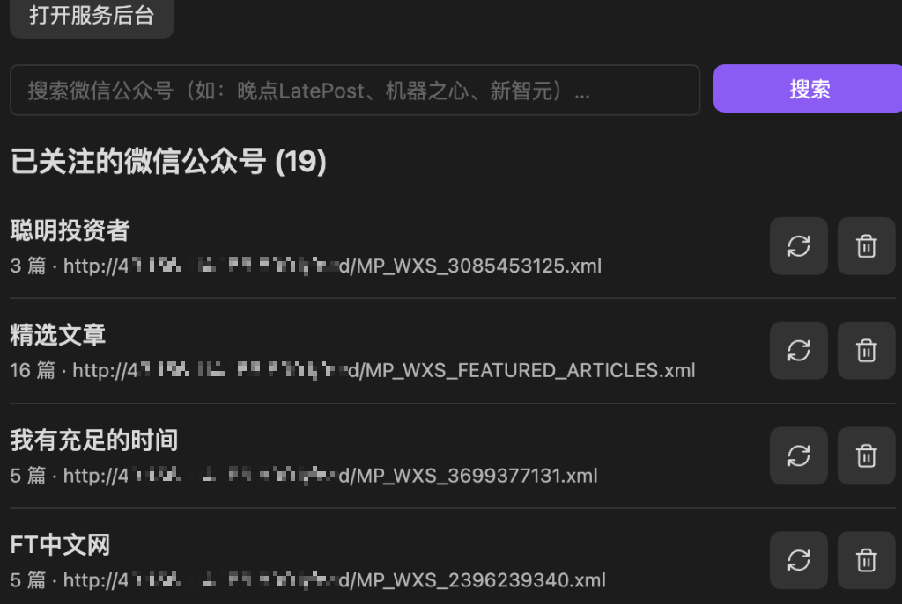

  
  <h1>Qiaomu RSS Plus · 乔木 RSS 增强版</h1>
  
<strong>专为中文深度阅读与知识创作者打造：微信公众号双轨订阅 · 万字全文无截断 · 防盗链本地图床 · Notion 风格细线大纲 · 行间高亮批注 ·「读-记-存-用」全闭环</strong>

  

    
    
    
    
  

---

## 🌟 为什么需要 Qiaomu RSS Plus？

原版 **Qiaomu AI RSS** 由 [@joeseesun（向阳乔木）](https://github.com/joeseesun) 精心打造，凭借内置的朱雀仿宋排版、双栏自适应版心和优雅的阅读交互，堪称 Obsidian 生态中最具美感的阅读插件之一。

然而在中文互联网的深度阅读场景中，知识创作者往往面临几大痛点：
1. **中文一手深度内容沉淀在微信公众号**：科技长文、投研笔记、深度访谈绝大多数发布在微信生态中，原版受限于风控无法直接订阅微信；
2. **万字长文截断与图片防盗链失效**：深度干货长文常被限制字符截断并强制跳转原文，且微信图片因防盗链机制容易裂开或在原推文删除后 404；
3. **缺少长文目录导航与随读批注**：面对长文缺乏章节索引小地图；阅读过程中产生的灵感无法原地高亮与批注，无法沉淀为可复用的知识卡片。

**Qiaomu RSS Plus（乔木 RSS 增强版）** 在完整继承原版全部优良特性的基础上，深度重构了数据同步、去重裁决、文章解析与阅读交互组件，补齐了中文信息消费最核心的拼图，让知识在 Obsidian 本地真正实现 **「读 - 记 - 存 - 用」** 四位一体闭环。

---

## 🚀 核心增强特性一览

### 1. 📱 微信公众号双轨订阅生态 (WeChat Dual-Track)
彻底打破微信生态的封闭壁垒，提供两条优雅的订阅路径：
- **途径一：微信读书（WeRead）联动静默同步**：扫码一次微信读书授权（配合轻量级云端 `we-mp-rss` 服务），你在微信读书中关注的所有公众号及精选推荐流，会在后台自动生成私有安全 RSS，静默无感同步进 Obsidian。
- **途径二：弹窗关键词直搜 + 扫码添加**：在 Obsidian 插件面板直接搜索公众号名称，系统直接调出公众号简介、头像和关注二维码，手机扫码关注后秒级添加进专属频道。
- **一键扫码诊断面板**：设置中内置微信授权状态与 Session 续期面板，过期时一键弹码重扫，平滑无感知。

  
  
<em>▲ 在 Obsidian 插件内直接搜索添加微信公众号与订阅源管理后台</em>

---

### 2. ⚡ 跨渠道长短链接智能对齐与标题去重 (Canonical Key Deduplication)
- **破除长短链“罗生门”**：聚合推荐流通常携带长参数链接（`__biz`、`mid`、`idx`），而独立频道常为精简短链（`mp.weixin.qq.com/s/...`）。增强版重构了 `canonicalEntryKey` 算法，引入基于清洗后标题特征的归一化对齐机制。
- **专属频道优先裁决**：当聚合源与专属公众号频道发生推文冲突时，自动保留专属频道的纯净短链，并将阅读标记、本地已读状态与 AI 摘要无缝合并，彻底杜绝重复推文刷屏。

---

### 3. 📥 单篇微信长文秒级剪藏 (Instant Article Clipper)
- 遇到朋友发来的爆款文章不想关注整个公众号？
- 直接在插件中粘贴任意 `mp.weixin.qq.com/...` 链接，后台无头浏览器秒级抓取全文，自动解析作者并归类至对应专属公众号频道。
- **异步轮询与防抖对齐**：内置 4 轮异步轮询机制与智能重试，将本地缓存锁优化至 15 秒，彻底解决云端 Feed 生成延迟导致的“添加成功却刷新不出来”问题。

---

### 4. 📖 突破字数截断 & 微信防盗链本地图床 (Unlimited Length & Local Vault)
- **万字长文完整畅读**：彻底移除原版单篇 100,000 字符限制与截断警告，无论两万字的行业研报还是长篇对话逐字稿，均完整加载呈现。
- **本地防盗链图床**：针对微信公众号图片防盗链限制，全自动异步将外链图片安全下载固化到 Obsidian 本地 Vault 附件缓存中。即使拔掉网线或原文被删（404），本地全文与图片依然毫秒级秒开。

---

### 5. 🗺️ Notion 风格悬浮细线大纲小地图 (Notion-style Floating Mini-TOC)
- **极简隐形设计**：正文右侧悬浮极简细线大纲（Mini Outline），自适应 H1/H2/H3/H4 标题层级，平时轻量隐形，完全不挤占正文阅读空间。
- **章节 Tooltip 预览与平滑跳转**：鼠标滑过短线即可浮出黑底白字的原生 Tooltip 章节标题；点击平滑滚动（smooth scroll）直达指定位置；当前阅读小节动态墨绿高亮（`#059669`），长文阅读进度一目了然。
- **自然时间线分组**：文章列表告别机械的冷冰冰未读红点，按“今天、昨天、本周、更早”自然时间线智能折叠组织。

  
  
<em>▲ 沉浸式阅读界面：自然时间线分组、仿宋极简排版与右侧 Notion 风格细线大纲小地图</em>

---

### 6. ✍️ 行间随读高亮与即时批注 (In-line Highlights & Annotations)
- **随手荧光划线**：鼠标选中文本立即唤起悬浮工具栏，支持荧光黄、薄荷绿、雅致蓝等多种色彩高亮及下划线。
- **行间即时批注**：选中任意段落敲下灵感思考，批注紧贴原文段落原地常驻展示，如同在实体书边页随手写下批注，阅读思路不被打断。

  
  
<em>▲ 正文阅读时随手划线高亮与行间批注悬浮工具条</em>

---

### 7. 🔗 「读 - 记 - 存 - 用」卡片笔记与知识图谱闭环 (PKM Integration)
- **一键沉淀笔记**：阅读完成后，点击顶部笔记图标，即可将整篇高亮金句、行间批注连同文章元数据（标题、作者、日期）一键导出为独立卡片笔记，或追加写入当天的 **Daily Notes（今日日记）**。
- **双链双向回跳**：导出的笔记自动生成 Obsidian 内部回跳链接（`obsidian://qiaomu-ai-rss?...`），点击即可精准跳回插件内对应文章。
- **赋能内容创作**：为后续知识图谱串联、二次思考、播客/公众号原创文章创作提供源源不断的素材弹药库。

---

## 📊 原版 vs 增强版功能对比

| 功能特性 | Qiaomu AI RSS (原版) | Qiaomu RSS Plus (增强版) |
| :--- | :---: | :---: |
| **仿宋排版与自适应双栏** | ✅ | ✅ |
| **独立博客与探索订阅** | ✅ | ✅ |
| **AI 摘要与版本切换** | ✅ | ✅ |
| **微信公众号双轨订阅** | ❌ (未支持) | ✅ **支持（微信读书授权 + 弹窗直搜扫码）** |
| **单篇微信长文即时剪藏** | ❌ | ✅ **支持（无头抓取 + 自动频道归档）** |
| **字数限制与截断警告** | ⚠️ 100,000 字符强制截断 | ✅ **彻底解除限制，万字全文畅读** |
| **微信防盗链图片本地固化** | ⚠️ 依赖原链接（易裂开/404） | ✅ **异步固化至 Vault 本地，断网可读** |
| **微信长短链接去重裁决** | ❌ (易跨频道重复显示) | ✅ **标题归一化对齐 + 专属频道优先** |
| **Notion 风格细线大纲 (TOC)** | ❌ | ✅ **悬浮细线小地图 + 墨绿动态追踪** |
| **正文多色高亮划线** | ❌ (仅支持记到日记) | ✅ **多色荧光高亮 + 下划线** |
| **行间随读即时批注** | ❌ | ✅ **正文行间常驻批注** |
| **自然时间线分组** | ❌ | ✅ **今天/昨天/本周/更早 智能折叠** |
| **知识闭环导出 (PKM)** | 基础日记追加 | ✅ **高亮+批注+元数据全量卡片导出与回跳** |

---

## 🛠️ 安装与配置指南

### 方式一：手动安装（推荐）
1. 前往 [Releases](https://github.com/yww520/qiaomu-ai-rss/releases) 页面下载最新的 `main.js`、`manifest.json`、`styles.css`。
2. 打开你的 Obsidian 库配置目录（默认为 `.obsidian/`），在 `plugins/` 下新建文件夹 `qiaomu-ai-rss`。
3. 将下载的三个文件放入 `.obsidian/plugins/qiaomu-ai-rss/`。
4. 打开 Obsidian 设置 → **第三方插件**，重新加载并启用 **Qiaomu RSS Plus (乔木 RSS 增强版)**。

### 方式二：BRAT 安装
1. 在 Obsidian 中安装社区插件 **BRAT**。
2. 在 BRAT 设置中添加 GitHub 仓库：`yww520/qiaomu-ai-rss`。
3. 点击添加后自动完成安装并启用。

---

## ⚙️ 微信公众号服务配置 (`we-mp-rss`)

增强版使用轻量、安全、去中心化的开源后台 `we-mp-rss` 提供微信读书授权与公众号解析：
1. 准备一台轻量云服务器或局域网 NAS（推荐运行 Docker）；
2. 部署 `we-mp-rss` 镜像；
3. 打开 Obsidian 设置 → **Qiaomu RSS Plus** → **微信公众号 (We-MP-RSS)**：
   - **云端服务地址**：填写你的服务访问地址（如 `http://127.0.0.1:8001` 或 `http://your-server-ip:8001`）；
   - **访问 Token / API Key**：如果服务开启了鉴权，在此填入 Token 即可；
4. 点击插件列表顶部 **+ → 微信公众号订阅**，扫码完成微信读书授权，即可开始享受无痛的公众号订阅之旅！

> 🔒 **隐私与安全说明**：
> - 所有服务地址、Token 及授权凭证均保存在你本地 Vault 的 `data.json` 中，绝不会上传至任何第三方服务器；
> - 所有文章数据、图片附件、划线与批注均存储在你的本地硬盘中，真正做到数据自主。

---

## 🗺️ 未来路线图 (Roadmap)

- [x] 微信公众号双轨订阅与单篇剪藏
- [x] 突破万字字符截断与防盗链本地图床
- [x] Notion 风格细线大纲小地图与自然时间线
- [x] 行间高亮划线与即时批注
- [x] 「读-记-存-用」卡片笔记与日记联动
- [ ] **从「内容消费」迈向「内容创作」**：打通素材库到原创写作的通道，由 AI 辅助将碎片批注、金句灵感与研报素材一键串联为选题大纲或文章草稿；
- [ ] **本地无头浏览器抓取方案探索**：进一步降低对外部云服务器的依赖；
- [ ] **全文检索与混合向量检索集成**：在本地海量历史文章与批注中实现秒级语义反查。

---

## 📜 开源协议与致敬

- 本项目基于 **GNU General Public License v3.0** 开源。详见 [LICENSE](LICENSE)。
- 衷心感谢原项目创作者 [@joeseesun（向阳乔木）](https://github.com/joeseesun) 的卓越工作，为中文 Obsidian 社区带来了如此优雅的阅读体验！
- 原项目地址：[joeseesun/qiaomu-ai-rss](https://github.com/joeseesun/qiaomu-ai-rss)。
- 内置朱雀仿宋字集遵循 SIL OFL 1.1 开源协议。
